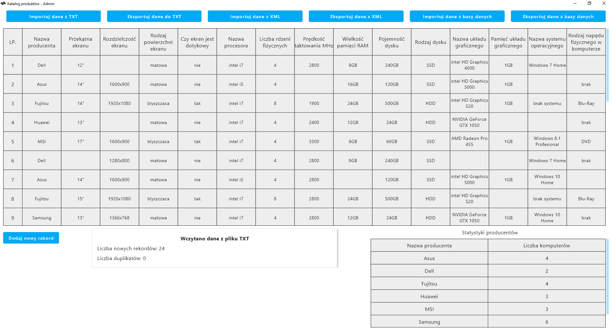
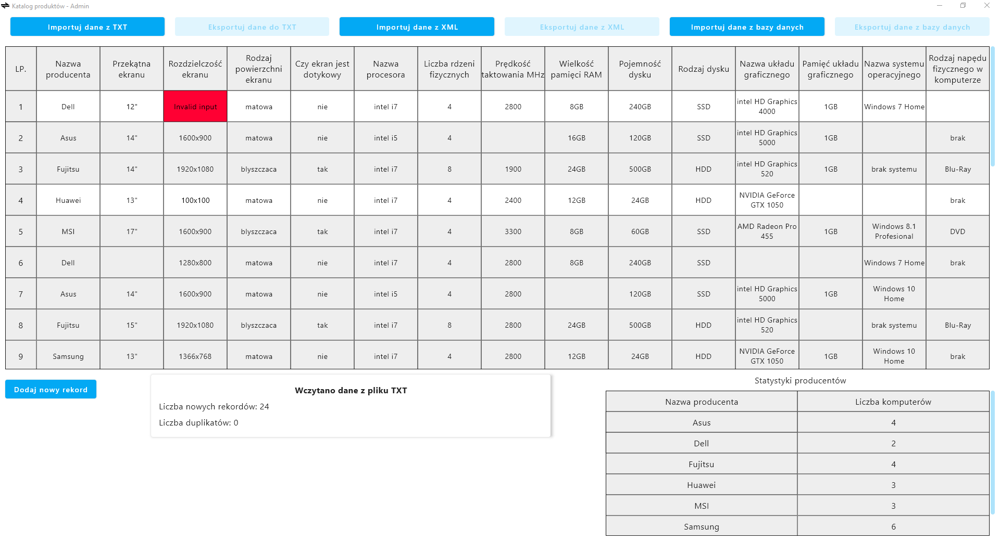
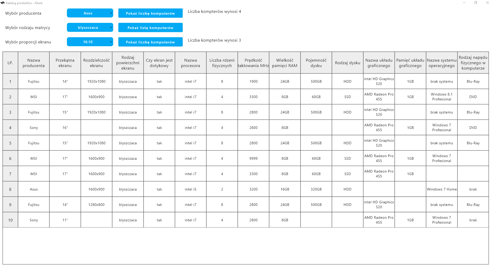

# Product Catalog
### Admin and client desktop application for managing products.

The goal of this project is to create two desktop applications, one for the administrator and one for the client. 
The administrator application allows to store and manage a detailed list of personal computers.
The client application allows to read and filter the list of PCs provided by the administrator. 
Both applications communicate using SOAP protocol.

## Getting Started

These instructions will get you a copy of the project up and running on 
your local machine for development and testing purposes.

### Prerequisites

* JDK 15
* IntelliJ IDEA Community Edition or Ultimate Edition [2020.3 or later]

Detailed information about installation and configurations are provided at developers' site.

## Technology Stack

* Kotlin
* Jetpack Compose for Desktop - [jetbrains/compose-jb](https://github.com/jetbrains/compose-jb)
* Java 15
* SQLite

### Build 

Please notice that the project contains source code for two desktop applications.
To run a specific application, use Gradle ```run``` or ```runDistributable``` tasks for that application.

For detailed information about Gradle tasks in Compose Multiplatform, please follow [official example](https://github.com/JetBrains/compose-jb/tree/master/tutorials/Getting_Started).

## Preview

<table>
    <tr>
        <td>
            <p>Administrator Application</p>
            
        </td>
    </tr>
    <tr>
        <td>
            <p>Data Management</p>
            
        </td>
    </tr>
    <tr>
        <td>
            <p>Client Application</p>
            
        </td>
    </tr>
</table>

## Author

* **Michał Koziara** 
